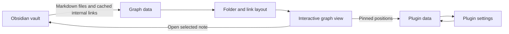
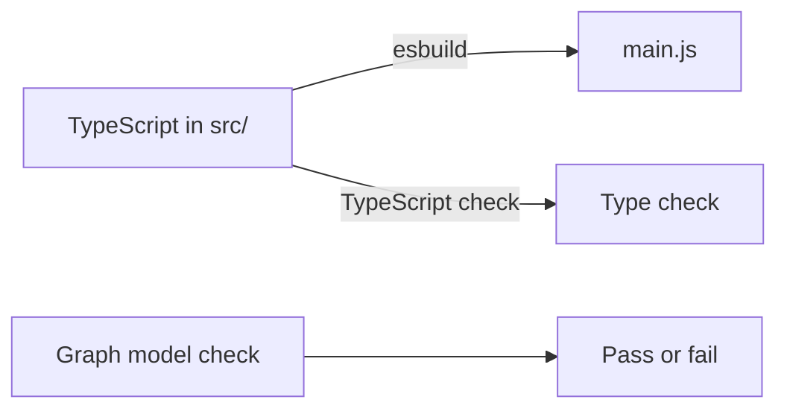

# Graph Plus

Graph Plus is an Obsidian plugin that turns your Markdown notes and their internal links into a folder-aware, zoomable graph. Notes appear inside nested folder clouds; links, recent edits, and note freshness help reveal structure and activity.

> **Status:** Early development. Features and visuals may change.

## Features

- Open the graph from the ribbon icon or the **Open graph** command.
- Optionally open it at startup when the workspace has no open notes.
- Browse nested folder clouds; zoom, pan, and fit the graph to the view.
- Filter notes by name and open a note from its graph node.
- Drag notes to arrange them; pinned positions persist across restarts.
- See connections, recent notes, and freshness at a glance.
- Adjust the colour palette, cloud and link appearance, node size, hover dimming, recent-note count, and freshness period in plugin settings.

## How it works



Graph Plus uses Obsidian's vault and metadata-cache APIs. It reads Markdown note paths, display names, modification times, folder paths, and resolved internal links to build the graph. It does not need a network connection or an external service.

## Privacy

- Graph data is built locally from the current vault and kept in memory while the graph view is open.
- The plugin saves its settings and pinned note positions through Obsidian's plugin-data storage. Pinned positions are associated with note paths.
- Graph Plus does not send vault content, note names, paths, or graph data to a server. It does not include analytics or telemetry.

## Install

Install **Graph Plus** from Obsidian's Community plugins browser when it is published. To install a development build, copy `main.js`, `manifest.json`, and `styles.css` (if present) into:

```text
<Vault>/.obsidian/plugins/graph-plus/
```

Then reload Obsidian and enable **Graph Plus** in **Settings → Community plugins**.

## Develop

Requirements: Node.js 18 or newer and npm.

```sh
npm install
npm run dev       # Build and watch for changes
npm run build     # Type-check and create the production bundle
npm run lint      # Run ESLint
npm run test:graph # Check graph model behavior
```

The TypeScript source is in `src/`; the build outputs `main.js` at the project root.



## Settings

| Setting | What it changes |
| --- | --- |
| Open on startup | Opens the graph only when the workspace has no open Markdown notes. |
| Colour scheme | Selects folder-cloud colours. |
| Cloud opacity / softness | Changes cloud tint and edge blur. |
| Link opacity | Changes the visibility of graph links. |
| Hover dimming | Controls how strongly unrelated notes fade when hovering a note. |
| Node size | Scales note dots. |
| Recent notes | Sets how many recently edited notes remain highlighted. |
| Note freshness | Sets the age-decay period used for note and folder activity styling. |

## License

See the license declared in [`package.json`](package.json).
